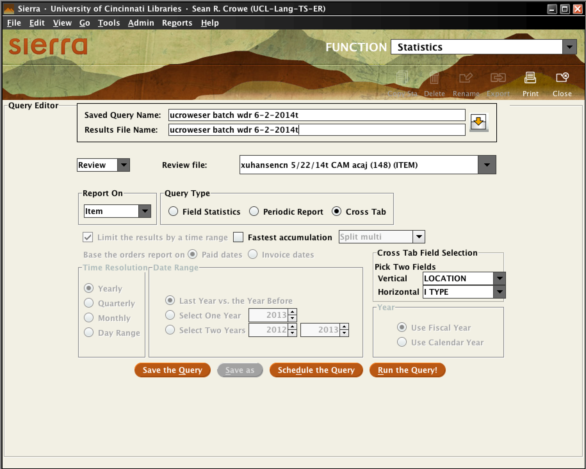
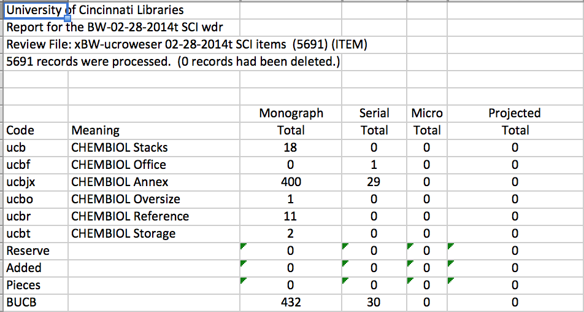

#Group Batch Withdrawal#
```rev 6/1/2014```  

* Run item review file in Sierra gathering item records, limited to local jurisdictions and marked item status = 'w' 
* Collect statistics based on the item info
* Batch delete items, run Loc Sync; bibs with no remaining attached records get marked for deletion
* Suppress Bibs with remaining orders attached but no items
* Check print bibs with URLs and recatalog as e-format where appropriate
* Remove Worldcat holdings for titles that we no longer hold

##1. Create All review files in Sierra: Item, Bibliographic, Checkin records

### Create Item list. In Sierra, create review file using Saved Search Strategy ```BatchWdr-ucrawfotj UL batch wdr (items)``` for local jurisdictions, exclude Gov't Documents locations which are handled separately.


### Create Bib List.  Create a bib review file from item review file with no filters/qualifiers (you want a review file of all the attached bib records). After deleting the items marked for withdrawal, you will need this review file to determine WorldCat holdings and for cleanup.

### Create Checkin LIst. Create a checkin review file from the bib review file. There will not always be a checkin record for every bib record, and there will probably be some checkin records for jurisdictions and libraries not included in the process.  Either remove use Golbal Update to remove unneeded records, or remove them from the spreadsheet that will be created.


##2. Create Spreadsheet##
Use spreadsheet to count, figure and record adjustments for statistics for the withdrawal.

1. In Sierra, go to Function drop-down and select *Cataloging* - *Statistics*
1. Click ```New query```
1. Add a meaningful title to the ```Saved Query Name``` and ```Results File Name``` (follow review file naming conventions.
1. Select ```Review``` from dropdown menu and select your withdrawl review file from the ```Review file``` dropdown menu.
1. Select ```Cross Tab``` radio button under ```Query Type```
1. Under ```Cross Tab Field Selection```, select Vertical: LOCATION, Horizontal: I TYPE
1. Click ```Run the Query!``` button. 
1. After momentary pause for query to run, highlight your query in results page and click ```View Report``` button
1. On left ```Select Report``` menu, click on ```Record Count``` heading
1. Click ```Export``` button and select ```Open in Excel```  



  

##3. Organize the spreadsheet   

Reorder lines and columns on the spreadsheet to correspond to the ARL format reporting categories and the order of the locations codes in the Stats database form.  

```
Organize columns by format:

Format          Itype
------          -----
Monograph        1, 3, 5, 24, 25,* 33, 51, 75,* 83
Serial           2, 6, 7, 8, 25,* 34, 52 75,* 84
Sound Rec       16, 17, 66, 67
Score            4, 35, 85
Microform        9, 10, 11, 59, 60, 61
Proj Medium     23, 28, 73, 78
Map             32, 36, 82, 86
Computer File   22, 72, (99)
2-D object      12, 13, 14, 15, 29, 30, 31, 62, 63, 64, 65, 79, 80, 81
Models, etc     18, 19, 21, 68, 69, 71
Kit             20, 70
Manuscript      37
 
Organize *and group* rows by location. Below each grouping, 
add new rows for Pieces, Reserves, Added, and Location Total 
e.g. BULA, BUAR, etc.

BULA (Langsam)
BUAR (ARB)
BUAS (CAS)
BUCM (CCM)
BUCB (Chem/Biol)
BUCL (Classics)
BUCL-Mod (Mod Greek)
BUCR (CRC)
BUDA (DAAP)
BUEL (Elreview fileon)
BUEN (Engr)
BUGP (GMP)
BOLIN
BUINT
 
BUCB-Chem
BUCB-Biol
 
BUGP-Geo (Geo)
BUGP-Math (Math)
BUGP-Phys (Phys)
```  



##4. Count Materials  
Most of the items will be 1:1 item to piece, however, many item records represent materials with multiple pieces/formats. In order to determine and count status for these multi-facetd materials, we examine the item types that with multis more closely.  
Export fields from the review file that will indicate format and piece count for items that don't have explicit itypes and/or could have multiple pieces e.g. Mixed Materials, Projected, Computer. Record accompanying pieces and adjust count by format on the excel spreadsheet.  You can use the Excel *notes* feature to add comments about adjustments.
Export fields:

* RECORD #(item)
* MESSAGE (item)
* CALL #(item)
* LOCATION (item)
* ITYPE
* BCODE2
* LOCATION (bib)
* OCLC #
* TITLE

*Microform*  

> Multiple pieces to a single item record. See item MESSAGES field). Make note of stats by location. \*Item counts as 1 record, count addition as "Pieces" in the spreadsheet.
 
*Computer* 

> For Computer itypes including *99*, determin content type by examining *bcode2* in the bib and record under appropriate format as *pieces*. Deduct as needed from itype 22, 72, and 99. Typically assign to arbitrary itype i.e. Monographs = itype '1'. *For added materials such as CDROMS from mixed material itypes, record as computer*.

*Sound Recording*  

> Itypes 16-17, 66-67. Check item MESSAGE field for multipe discs. 

``````Video Recording``````  

> Itypes 23 and 73, likely multiple pieces; record item record as 1, then additional in Pieces.  

*Mixed Media*  

> Itypes 25 and 75, multiple pieces to a single item record, check the MESSAGES field. Easiest approach is to move these columns to a seperate sheet and record item plus added pieces on the main sheet under appropriate format, use arbitrary itype e.g. Monograph = itype '1'. Check bcode2 to determin format of text; ``````DO NOT`````` attempt to determine format of added media: CD/DVDROMS are recorded as computer type.

*Reserve*  

> Move columns to secondary sheet and check bcode2 to determine format. Record in *Reserves* row in main spreadsheet, use arbitrary itype that correspondes to correct format.

*Score*  

> Limit by *ITEMMESSAGE* = 'p' (check for parts). These will be primarily in CCM.

##5. Create Bib List  

Create a bib review file based your item review file with no filters/qualifiers (you want a review file of all the attached bib records). After deleting the items marked for withdrawal, you will need this review file to determine WorldCat holdings and for cleanup.

##6. Delete Items  

Run a batch delete on the item review file. Some items will not be deleteable because they are still checked out, or, on reserve, or attached to other bibs. Examine and delete remaining items manually, based on batch delete report.

##7. Run Loc Sync  

Run Loc Sync on the bib review file.

##8. Cleanup URLs On Print Bibs  

```
ITEM LOCATION = UINT
OR ITEM LOCATION = OLINK
OR BIBLIOGRAPHIC MARC FIELD 856 FIELD not equal to ''
OR BIBLIOGRAPHIC MARC FIELD 956 FIELD not equal to <blank>
```

##9. Cleanup Orphan Orders##

```
BIBLIOGRAPHIC LINKED REC not exist to ITEM
AND BIBLIOGRAPHIC LINKED REC not ``````exist`````` to ORDER
AND BIBLIOGRAPHIC LINKED REC not exist to CHECKIN
```

##10. Remove WorldCat Holdings##

```
BIBLIOGRAPHIC LINKED REC not exist to ITEM
AND BIBLIOGRAPHIC LINKED REC not exist to ORDER
AND BIBLIOGRAPHIC LINKED REC not exist to CHECKIN
```


